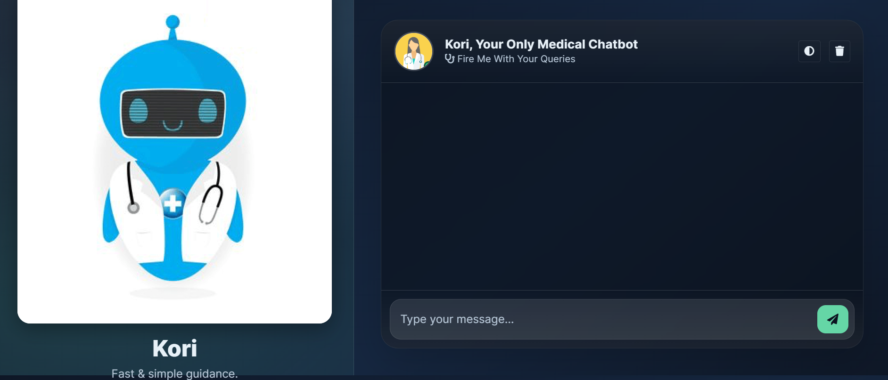
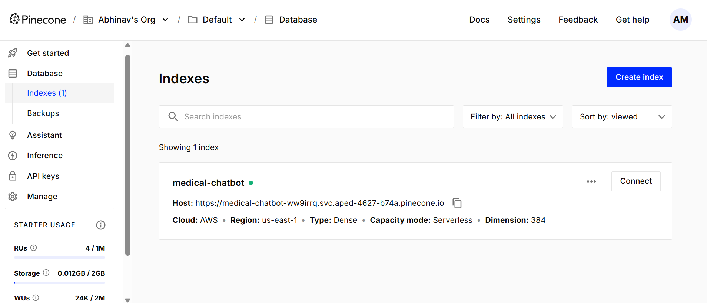

<h1 align="center">🩺 Complete Advanced Medical ChatBot</h1>

<p align="center">
  <a href="https://www.python.org/"></a>
  <a href="LICENSE"></a>
  <a href="https://github.com/Abhi12002/CompleteAdvanced-MedicalChatBot/stargazers"></a>
</p>

---

<a name="table-of-contents"></a>
## 📑 Table of Contents
- <a href="#project-overview">📝 Project Overview</a>
- <a href="#demo">🖼️ Demo</a>
- <a href="#features">🚀 Features</a>
- <a href="#technologies-used">🛠️ Technologies Used</a>
- <a href="#dataset">📊 Dataset</a>
- <a href="#technical-architecture-and-workflow">🏗️ Technical Architecture & Workflow</a>
- <a href="#installation-and-setup">⚙️ Installation and Setup</a>
- <a href="#usage">💡 Usage</a>
- <a href="#project-structure">🗂️ Project Structure</a>
- <a href="#testing-and-validation">🧪 Testing & Validation</a>
- <a href="#limitations-and-challenges">🚧 Limitations & Challenges</a>
- <a href="#future-work">🛣️ Future Work</a>
- <a href="#contributing">🤝 Contributing</a>
- <a href="#license">📜 License</a>
- <a href="#acknowledgments">🙏 Acknowledgments</a>
- <a href="#contact">📬 Contact</a>

---

<a name="project-overview"></a>
## 📝 Project Overview
**Complete Advanced Medical ChatBot** is an AI-powered medical assistant built with <b>LangChain</b>, <b>Pinecone</b>, <b>OpenAI GPT-4o</b>, and <b>Flask</b>.  
It ingests medical literature (PDF), indexes it in a vector database, and uses a Retrieval-Augmented Generation (RAG) pipeline to provide <b>concise, context-aware answers</b> to user queries.<br>
<b>Deployed Live:</b> <a href="http://54.147.198.67:8080/">http://54.147.198.67:8080/</a>

---

<a name="demo"></a>
## 🖼️ Demo
| ChatBot Interface |
|:-----------------:|
|  |

---

<a name="features"></a>
## 🚀 Features
- <b>Domain-Specific RAG</b>: Retrieval-Augmented Generation tailored for medical PDFs.
- <b>Semantic Search</b>: Uses HuggingFace embeddings and Pinecone for vector search.
- <b>Conversational Memory</b>: Maintains chat context per browser session.
- <b>Flask Web Interface</b>: Minimal UI with HTML/CSS frontend.
- <b>PDF Loader</b>: Automatically ingests and chunks large documents.
- <b>Dockerized</b>: Runs anywhere with a single container build.
- <b>CI/CD Pipeline</b>: GitHub Actions → AWS ECR → EC2 deployment.

---

<a name="technologies-used"></a>
## 🛠️ Technologies Used
- <b>Python 3.10+</b>
- <b>Flask</b> (Web server)
- <b>LangChain</b> (LLM orchestration)
- <b>Pinecone</b> (Vector DB)
- <b>HuggingFace Transformers</b> (Embeddings)
- <b>OpenAI GPT-4o</b> (LLM)
- <b>Docker</b> (Containerization)
- <b>AWS</b> (ECR, EC2, GitHub Actions)

---

<a name="dataset"></a>
## 📊 Dataset
- <b>Source:</b> Local <code>medical_book.pdf</code> under <code>Data/</code>
- <b>Content:</b> Medical domain reference material for chatbot context
- <b>Usage:</b> Loaded via <code>PyPDFLoader</code>, chunked with <code>RecursiveCharacterTextSplitter</code>, embedded via HuggingFace model

---

<a name="technical-architecture-and-workflow"></a>
## 🏗️ Technical Architecture & Workflow
<pre>
[User] 
   ↓
[Flask Web App + HTML UI]
   ↓
[RAG Pipeline: Retriever + GPT-4o LLM]
   ↓
[Pinecone Vector DB] ← [Embeddings: HuggingFace MiniLM-L6-v2]
   ↑
[PDF Loader: medical_book.pdf]
</pre>

<b>Key Components:</b><br>
- <code>helper.py</code> → PDF loading, text splitting, embeddings<br>
- <code>index_store.py</code> → Ingests documents into Pinecone<br>
- <code>prompt.py</code> → System prompt template<br>
- <code>app.py</code> → Web server, retrieval chain, session memory

---

<a name="installation-and-setup"></a>
## ⚙️ Installation and Setup  
<b>1️⃣ Clone Repository</b>  
```bash
git clone https://github.com/Abhi12002/CompleteAdvanced-MedicalChatBot.git
cd CompleteAdvanced-MedicalChatBot
```  
<b>2️⃣ Create Virtual Environment</b>  
```bash
python -m venv .venv
source .venv/bin/activate  # Windows: .venv\Scripts\activate
```  
<b>3️⃣ Install Requirements</b>  
```bash
pip install --upgrade pip
pip install -r requirements.txt
```  
<b>4️⃣ Set Environment Variables</b><br>  
Create a <code>.env</code> file:  
```env
PINECONE_API_KEY=your_pinecone_api_key
OPENAI_API_KEY=your_openai_api_key
AWS_ACCESS_KEY_ID=your_aws_access_key
AWS_SECRET_ACCESS_KEY=your_aws_secret
AWS_DEFAULT_REGION=us-east-1
```  
<b>5️⃣ Build Pinecone Index</b>  
```bash
python index_store.py
```  
<b>6️⃣ Run Locally</b>  
```bash
python app.py
```  
Visit: <a href="http://localhost:8080">http://localhost:8080</a>  

---

### 🧩 Pinecone Index (Serverless)

The project uses a Pinecone **Serverless** index for semantic retrieval.

- **Index name:** `medical-chatbot`  
- **Region:** `us-east-1`  
- **Dimension:** `384` (matches `sentence-transformers/all-MiniLM-L6-v2`)  

| Pinecone Console |
|:----------------:|
|  |


<a name="usage"></a>  
## 💡 Usage  
- Open the web interface in your browser<br>  
- Enter a question related to the ingested medical content<br>  
- The bot will return concise, context-aware responses<br>  
- Session history is maintained per browser tab until cleared  

---

<a name="project-structure"></a>  
## 🗂️ Project Structure  
<pre>
CompleteAdvanced-MedicalChatBot/
├── app.py               # Flask app, RAG chain, memory
├── index_store.py       # Data ingestion & Pinecone indexing
├── src/
│   ├── helper.py        # PDF loading, text splitting, embeddings
│   └── prompt.py        # System prompt
├── templates/
│   └── chat.html        # Frontend HTML
├── static/
│   └── style.css        # Frontend CSS
├── Data/
│   └── medical_book.pdf # Medical reference data
├── requirements.txt
├── Dockerfile
├── cicd.yaml            # GitHub Actions pipeline
├── setup.py
├── LICENSE
└── ChatBot-Pic.png
</pre>  

---

<a name="testing-and-validation"></a>  
## 🧪 Testing & Validation  
- <b>Functional:</b> Verified Q&A matches ingested content<br>  
- <b>Index Integrity:</b> Confirmed Pinecone index populates correctly<br>  
- <b>Load Testing:</b> Checked responsiveness under multiple simultaneous users<br>  
- <b>CI/CD:</b> Tested end-to-end from commit → ECR → EC2 deployment  

---

<a name="limitations-and-challenges"></a>  
## 🚧 Limitations & Challenges  
- Responses limited to ingested PDF; will say "I don't know" if outside context<br>  
- No authentication; open endpoint in current version<br>  
- Per-session memory resets on page refresh  

---

<a name="future-work"></a>  
## 🛣️ Future Work  
- Multi-PDF ingestion and indexing<br>  
- Role-based access and authentication<br>  
- Better UI with chat history display<br>  
- Integration with medical terminology ontologies for richer context<br>  
- Deployment on scalable container platforms  

---

<a name="contributing"></a>  
## 🤝 Contributing  
Pull requests welcome. Please:<br>  
1. Fork the repo<br>  
2. Create a new branch<br>  
3. Commit changes with clear messages<br>  
4. Submit a PR  

---

<a name="license"></a>  
## 📜 License  
This project is licensed under the <b>Apache 2.0 License</b> – see the <a href="LICENSE">LICENSE</a> file.  

---

<a name="acknowledgments"></a>  
## 🙏 Acknowledgments  
- <b>LangChain</b>, <b>Pinecone</b>, and <b>OpenAI</b> teams for their tooling<br>  
- <b>HuggingFace</b> for MiniLM embeddings<br>  
- AWS for hosting  

---

<a name="contact"></a>  
## 📬 Contact  
<b>Abhinav Mishra</b><br>  
<a href="https://www.linkedin.com/in/abhinav-mishra-4b72b120b/">LinkedIn</a><br>  
<a href="https://github.com/Abhi12002">GitHub</a><br>  
<a href="https://abhi12002.github.io/">Portfolio</a><br>

---

⭐ If you found this project useful, please <b>star</b> the repo and share it!  

